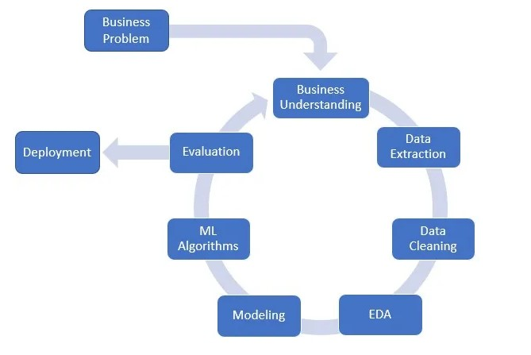
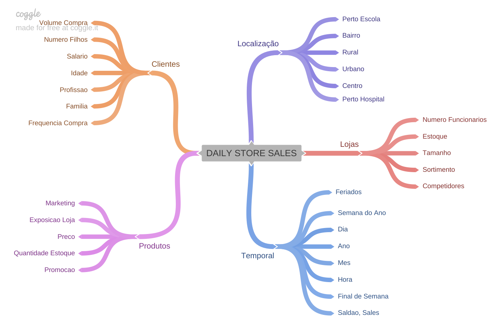
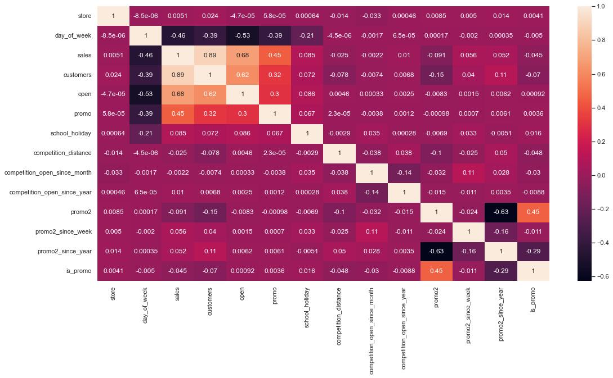

# Previsão de vendas para a Rossmann Drugstore

# 1 - INTRODUÇÃO
## 1.1 - Sobre a Rossmann Drugstore

A Rossmann é uma das maiores cadeias de farmácias da Europa, com aproximadamente de 56.200 funcionários e mais de 4.000 lojas. Em 2019, a Rossmann faturou mais de 10 bilhões de Euros em diversos países.

Em 2021, as vendas aumentaram 8,1% para 11,1 bilhões de euros. Há um total de 4.361 filiais da Rossmann, sendo 2.231 na Alemanha. O número atual de filiais estrangeiras é: Polônia (1580), Hungria (mais de 230), República Tcheca (mais de 150), Turquia (mais de 120), Albânia (15), Kosovo (6) e Espanha (5).

## 1.2  - Questão e entendimento do negócio

Atualmente, os gerentes de loja da Rossmann têm a tarefa de prever suas vendas diárias com até seis semanas de antecedência. A demanda partiu do CFO da empresa, pois a rede pretende fazer uma série de reformas e alterações no visual de suas unidades a fim de renovar e melhorar a imagem de sua empresa, agregando valor a mesma.

As vendas da loja são influenciadas por muitos fatores, incluindo promoções, concorrência, feriados escolares e estaduais, sazonalidade e localidade. Com milhares de gerentes individuais prevendo vendas com base em suas circunstâncias únicas, a precisão dos resultados pode variar bastante, assim gerando um cenário desafiador para a empresa. Assim, o papel do cientista de dados se torna fundamental para esse processo se tornar mais eficiente e confiável.

## 1.3 - Dados utilizados

Para a resolução do problema de negócio foram disponibilizados dados históricos de vendas de 1.115 lojas Rossmann na plataforma [Kaggle](https://www.kaggle.com/c/rossmann-store-sales). O histórico é referente aos dados destas lojas do ano de 2015 até 2017. Vale ressaltar que algumas lojas no conjunto de dados foram temporariamente fechadas para reforma.

As seguintes features são encontradas no dataset:

| Atributos | Descrição |
| ------ | ------- |
| Id | Identificador da transação |
| Store | Identificador único para cada loja |
| Sales | Total de vendas no dia (target) |
| Customers | Número de clientes no dia |
| Open | Indica se a loja está aberta ou fechada ( 0 = fechada, 1 = aberta) |
| StateHoliday | Indica feriado estadual, normalmente as lojas fecham nos feriados |
| SchoolHoliday | Indica feriado escolar |
| StoreType | Tipo da loja |
| Assortment | Nível de variedade de produtos da loja |
| CompetitionDistance | Distância em metros do concorrente mais próximo |
| CompetitionOpenSince | Indica mês e ano que o concorrente mais próximo abriu |
| Promo | Descreve se está ocorrendo alguma promoção na loja |
| Promo2 | Descreve se houve extensão do prazo final da promoção |
| Promo2Since | Descreve mês e ano que a loja iniciou a Promo2 |
| PromoInterval | Descreve os intervalos consecutivos em que a Promo2 é iniciada |

# 2 - METODOLOGIA

## 2.1 - Planejamento da Solução

Para o desenvolvimento do projeto foi utilizada um processo cíclico chamado CRISP-DS (Cross-Industry Standard Process - Data Science). A ideia principal é percorrer as fases do processo, para que você tenha, de forma ágil, um produto mínimo viável a agregar ao negócio. Depois de percorrer o primeiro ciclo, você pode iterar novamente, encontrar novos insights, criar novas features, melhorar o modelo, ajustar parâmetros, a fim de a precisão e entregar mais valor. O ciclo pode ser repetido quantas vezes forem necessárias até atingir o objetivo final do time de negócio.

***Etapas do método CRISP-DS***

## 2.2 - Desenvolvimento da Solução

Seguindo a metodologia CRISP-DS a seguinte sequência de tarefas foram realizadas no desenvolvimentos do projeto:

***Passo 01 - Descrição dos dados:***

Esta etapa consiste em conhecer os dados (dataset) e suas dimensões. É verificado também quais os tipos de variáveis estão presentes no dataset (numéricas, categóricas, temporais) e também os dados faltantes e suas motivações, pois estes podem inviabilizar a continuidade projeto. Foi feito também uma análise descritiva dos dados para mensurar média, moda, mediana, desvio padrão, range, para assim ter uma noção de grandeza e limites dos dados. Com todas essas informações é possível aplicar as técnicas corretas para manipular os dados a fim de que o desenvolvimento flua.

Em linhas gerais, foram identificados e substituídos as linhas com dados faltantes, foi feito um check para saber o tipo dado era correto para cada uma das colunas e depois foi resumido todo o conteúdo do dados em uma tabela utilizando técnicas da estatística descritiva.

***Passo 02 - Feature Engineering:***

Nesta etapa a ideia principal é derivar features a partir do conjunto original de variáveis, assim, teremos as variáveis disponíveis para estudo durante a etapa de Análise Exploratória de Dados. Para isso, foi criado um mapa que serve como um roteiro para mostrar quais variáveis precisamos derivar para fazer determinadas análises através de uma lista empírica de hipóteses. Então a lista é analisada para validar ou descartar de cada uma dessas hipóteses, gerando, assim, insights para o projeto.

Vale ressaltar quais são os três elementos que constituem o mapa mental de hipósteses:
- FENÔMENO -> Aquilo que está sendo medido ou modelado (ex.: vendas)
- AGENTES -> Entidades que impactam o fenômeno (ex.: clientes, lojas, produtos)
- ATRIBUTOS DO AGENTE -> São os atributos que descrevem o agente (ex.: para o agente "cliente" temos os atributos idade, escolaridade, salário, etc.)

***Mapa Mental de Hipóteses***

***Passo 03 - Filtragem das Variáveis:***

O propósito desta fase consistiu em realizar uma filtragem criteriosa das linhas e excluir as colunas que não possuem relevância para o modelo em questão ou que estão além do escopo do negócio. Um exemplo disso seria a exclusão dos dias em que as lojas não estavam operando e/ou não registraram vendas, pois tais informações não contribuiriam para a análise e o entendimento dos dados.

***Passo 04 - Análise Exploratória dos Dados:***

O objetivo primordial desta etapa foi conduzir uma exploração minuciosa dos dados, a fim de descobrir insights relevantes e compreender melhor a importância das variáveis no processo de aprendizado do modelo. Para alcançar esse objetivo, foram realizadas análises em diferentes níveis: análise individual das variáveis (análise univariada), análise das relações entre cada variável e a variável de resposta (análise bivariada) e análise conjunta das variáveis (análise multivariada).

Para cada tipo de análise, utilizaram-se diversas técnicas e ferramentas estatísticas. Histogramas foram empregados para examinar a distribuição das variáveis, enquanto boxplots foram utilizados para analisar o intervalo e detectar possíveis valores atípicos. A matriz de confusão foi empregada para medir a correlação entre as variáveis, assim como o método de Kramer's V e outros métodos apropriados. Além disso, nesta fase, as hipóteses estabelecidas na etapa anterior foram testadas e confirmadas ou refutadas.

Adicionalmente, as features (variáveis) foram ordenadas de acordo com sua relevância para o modelo, proporcionando uma compreensão mais clara de quais características têm um impacto mais significativo nos resultados finais.

***Matriz de Confusão***

# 3 - INSIGHTS E RESULTADOS

# 4 -  CONCLUSÃO
