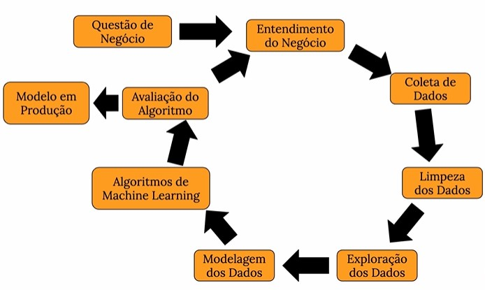

# Previsão de vendas para a Rossmann Drugstore

# 1 - INTRODUÇÃO
## 1.1 - Sobre a Rossmann Drugstore

A Rossmann é uma das maiores cadeias de farmácias da Europa, com aproximadamente de 56.200 funcionários e mais de 4.000 lojas. Em 2019, a Rossmann faturou mais de 10 bilhões de Euros em diversos países.

Em 2021, as vendas aumentaram 8,1% para 11,1 bilhões de euros. Há um total de 4.361 filiais da Rossmann, sendo 2.231 na Alemanha. O número atual de filiais estrangeiras é: Polônia (1580), Hungria (mais de 230), República Tcheca (mais de 150), Turquia (mais de 120), Albânia (15), Kosovo (6) e Espanha (5).

## 1.2  - Questão e entendimento do negócio

Atualmente, os gerentes de loja da Rossmann têm a tarefa de prever suas vendas diárias com até seis semanas de antecedência. A demanda partiu do CFO da empresa, pois a rede pretende fazer uma série de reformas e alterações no visual de suas unidades a fim de renovar e melhorar a imagem de sua empresa, agregando valor a mesma.

As vendas da loja são influenciadas por muitos fatores, incluindo promoções, concorrência, feriados escolares e estaduais, sazonalidade e localidade. Com milhares de gerentes individuais prevendo vendas com base em suas circunstâncias únicas, a precisão dos resultados pode variar bastante, assim gerando um cenário desafiador para a empresa. Assim, o papel do cientista de dados se torna fundamental para esse processo se tornar mais eficiente e confiável.

## 1.3 - Dados utilizados

Para a resolução do problema de negócio foram disponibilizados dados históricos de vendas de 1.115 lojas Rossmann na plataforma [Kaggle](https://www.kaggle.com/c/rossmann-store-sales). O histórico é referente aos dados destas lojas do ano de 2015 até 2017. Vale ressaltar que algumas lojas no conjunto de dados foram temporariamente fechadas para reforma.

As seguintes features são encontradas no dataset:

| Atributos | Descrição |
| ------ | ------- |
| Id | Identificador da transação |
| Store | Identificador único para cada loja |
| Sales | Total de vendas no dia (target) |
| Customers | Número de clientes no dia |
| Open | Indica se a loja está aberta ou fechada ( 0 = fechada, 1 = aberta) |
| StateHoliday | Indica feriado estadual, normalmente as lojas fecham nos feriados |
| SchoolHoliday | Indica feriado escolar |
| StoreType | Tipo da loja |
| Assortment | Nível de variedade de produtos da loja |
| CompetitionDistance | Distância em metros do concorrente mais próximo |
| CompetitionOpenSince | Indica mês e ano que o concorrente mais próximo abriu |
| Promo | Descreve se está ocorrendo alguma promoção na loja |
| Promo2 | Descreve se houve extensão do prazo final da promoção |
| Promo2Since | Descreve mês e ano que a loja iniciou a Promo2 |
| PromoInterval | Descreve os intervalos consecutivos em que a Promo2 é iniciada |

# 2 - METODOLOGIA

## 2.1 - Planejamento da Solução

Para o desenvolvimento do projeto foi utilizada um processo cíclico chamado CRISP-DS (Cross-Industry Standard Process - Data Science). A ideia principal é percorrer as fases do processo, para que você tenha, de forma ágil, um produto mínimo viável a agregar ao negócio. Depois de percorrer o primeiro ciclo, você pode iterar novamente, encontrar novos insights, criar novas features, melhorar o modelo, ajustar parâmetros, a fim de a precisão e entregar mais valor. O ciclo pode ser repetido quantas vezes forem necessárias até atingir o objetivo final do time de negócio.

***Etapas do método CRISP-DS***

## 2.2 - Desenvolvimento da Solução

Seguindo a metodologia CRISP-DS a seguinte sequência de tarefas foram realizadas no desenvolvimentos do projeto:

***Passo 01 - Descrição dos dados:***

Esta etapa consiste em conhecer os dados (dataset) e suas dimensões. É verificado também quais os tipos de variáveis estão presentes no dataset (numéricas, categóricas, temporais) e também os dados faltantes e suas motivações, pois estes podem inviabilizar a continuidade projeto. Foi feito também uma análise descritiva dos dados para mensurar média, moda, mediana, desvio padrão, range, para assim ter uma noção de grandeza e limites dos dados. Com todas essas informações é possível aplicar as técnicas corretas para manipular os dados a fim de que o desenvolvimento flua.

Em linhas gerais, foram identificados e substituídos as linhas com dados faltantes, foi feito um check para saber o tipo dado era correto para cada uma das colunas e depois foi resumido todo o conteúdo do dados em uma tabela utilizando técnicas da estatística descritiva.

***Passo 02 - Feature Engineering:***

Nesta etapa a ideia principal é derivar features a partir do conjunto original de variáveis, assim, teremos as variáveis disponíveis para estudo durante a etapa de Análise Exploratória de Dados. Para isso, foi criado um mapa que serve como um roteiro para mostrar quais variáveis precisamos derivar para fazer determinadas análises através de uma lista empírica de hipóteses. Então a lista é analisada para validar ou descartar de cada uma dessas hipóteses, gerando, assim, insights para o projeto.

Vale ressaltar quais são os três elementos que constituem o mapa mental de hipósteses:
- FENÔMENO -> Aquilo que está sendo medido ou modelado (ex.: vendas)
- AGENTES -> Entidades que impactam o fenômeno (ex.: clientes, lojas, produtos)
- ATRIBUTOS DO AGENTE -> São os atributos que descrevem o agente (ex.: para o agente "cliente" temos os atributos idade, escolaridade, salário, etc.)

***Mapa Mental de Hipóteses***

***Passo 03 - Filtragem das Variáveis:***

O propósito desta fase consistiu em realizar uma filtragem criteriosa das linhas e excluir as colunas que não possuem relevância para o modelo em questão ou que estão além do escopo do negócio. Um exemplo disso seria a exclusão dos dias em que as lojas não estavam operando e/ou não registraram vendas, pois tais informações não contribuiriam para a análise e o entendimento dos dados.

***Passo 04 - Análise Exploratória dos Dados:***

O objetivo primordial desta etapa foi conduzir uma exploração minuciosa dos dados, a fim de descobrir insights relevantes e compreender melhor a importância das variáveis no processo de aprendizado do modelo. Para alcançar esse objetivo, foram realizadas análises em diferentes níveis: análise individual das variáveis (análise univariada), análise das relações entre cada variável e a variável de resposta (análise bivariada) e análise conjunta das variáveis (análise multivariada).

Para cada tipo de análise, utilizaram-se diversas técnicas e ferramentas estatísticas. Histogramas foram empregados para examinar a distribuição das variáveis, enquanto boxplots foram utilizados para analisar o intervalo e detectar possíveis valores atípicos. A matriz de confusão foi empregada para medir a correlação entre as variáveis, assim como o método de Kramer's V e outros métodos apropriados. Além disso, nesta fase, as hipóteses estabelecidas na etapa anterior foram testadas e confirmadas ou refutadas.

Adicionalmente, as features (variáveis) foram ordenadas de acordo com sua relevância para o modelo, proporcionando uma compreensão mais clara de quais características têm um impacto mais significativo nos resultados finais.

***Matriz de Confusão***

***Passo 05 - Preparação dos dados:***

Nesta etapa, o objetivo principal foi selecionar os atributos mais relevantes para o treinamento do modelo. Para alcançar esse objetivo, foi empregado o algoritmo Boruta, uma técnica amplamente utilizada em ciência de dados. O algoritmo Boruta realizou a seleção das variáveis, destacando aquelas que apresentaram maior relevância para o fenômeno em estudo.

O algoritmo Boruta é uma abordagem baseada em técnicas de Random Forest, que avalia a importância das variáveis através de um processo iterativo. Ele compara o desempenho das variáveis originais com versões aleatórias (chamadas de sombras) e identifica quais variáveis possuem um desempenho estatisticamente superior. Dessa forma, o Boruta pode ajudar a identificar as variáveis mais relevantes, fornecendo insights sobre quais características têm maior influência nos resultados do modelo.

No entanto, é importante ressaltar que, em alguns casos, certas features criadas manualmente durante a etapa de Feature Engineering podem ter sido consideradas relevantes, mesmo que o algoritmo Boruta não as tenha selecionado. Portanto, essas features foram incluídas manualmente, reconhecendo seu potencial contributivo para o modelo, mesmo que não tenham sido destacadas pelo algoritmo Boruta.

***Passo 07 - Modelagem de Machine Learning:***

Na modelagem foram realizados os treinamentos dos modelos de machine learning selecionados para o problema em questão:

- Average Model
- Linear Regression
- Linear Regression Regularized (Lasso)
- Random Forest Regressor
- XGBoost Regressor

 Na primeira parte da etapa foi realizado a avaliação simples do modelo (Single Performance) e na segunda parte foi aplicado o método de Cross Validation (Real Performance). O método de validação cruzada consiste em separar os dados de teste em dois conjuntos: conjunto de teste e o menor de validação, após treinar e medir o desempenho do modelo esses dois conjuntos são redimensionados de forma a testar e validar o modelo em todas as porções dos dados.

Dentre os modelos testados, apesar de parecer contraditório, a escolha do modelo XGBoost foi baseado, entre outros fatores menores, no tempo de processamento do algoritmo, que é muito menor que o Random Forest, significando redução de custos de processamento e cloud. Além de que na etapa de Hyperparameter Fine Tuning será possível fazer ajustes significativos para melhora da performance.

Na fase de modelagem, foram conduzidos treinamentos dos modelos de machine learning selecionados para resolver o problema em questão. Dentre os modelos utilizados estavam o Average Model, Linear Regression, Linear Regression Regularizada (Lasso), Random Forest Regressor e XGBoost Regressor.

Inicialmente, foi realizada uma avaliação simples do desempenho dos modelos, conhecida como "Single Performance". Em seguida, foi aplicado o método de Cross Validation (Validação Cruzada) para obter uma avaliação mais robusta, também chamada de "Real Performance".

A técnica de Cross Validation é amplamente utilizada em problemas de ciência de dados, especialmente em casos de séries temporais. Ela consiste em dividir os dados em conjuntos de treinamento, teste e validação. No entanto, ao contrário da divisão tradicional em conjunto de treinamento e teste, a validação cruzada envolve a criação de múltiplos conjuntos de treinamento e teste, permitindo que cada porção dos dados seja usada como conjunto de teste em algum momento.

Essa abordagem é particularmente importante em problemas de séries temporais, onde a ordem dos dados é relevante. A validação cruzada nos permite avaliar o desempenho do modelo em diferentes períodos de tempo, o que ajuda a verificar se o modelo é capaz de generalizar bem e fazer previsões precisas em diferentes momentos.

Na tabela de "Single Performance", podemos observar as métricas de desempenho (MAE, MAPE e RMSE) para cada modelo individualmente. Já na tabela de "Real Performance", são apresentadas as métricas resultantes da aplicação do método de validação cruzada, com intervalos de confiança, representando a variabilidade do desempenho do modelo em diferentes divisões dos dados.

Single Performance:
| Model Name |	MAE |	MAPE |	RMSE |
|  --- | --- | --- | --- |
|	Average Model |	1354.800353 |	0.206400 |	1835.135542 |
|	Linear Regression |	1867.089774 |	0.292694 |	2671.049215 |
|	Linear Regression - Lasso |	1891.704881 |	0.289106 |	2744.451737 |
|	Random Forest Regressor |	679.598831 |	0.099913 |	1011.119437 |
| XGboost Regressor |	905.006642 |	0.132421 |	1319.485362 |

Real Performance:
| Model Name |	MAE CV |	MAPE CV |	RMSE CV |
|  --- | --- | --- | --- |
|	Linear Regression |	2081.73 +/- 295.63 |	0.3 +/- 0.02 |	2952.52 +/- 468.37 |
|	Lasso |	2116.38 +/- 341.5 |	0.29 +/- 0.01 |	3057.75 +/- 504.26 |
|	Random Forest Regressor |	836.61 +/- 217.1 |	0.12 +/- 0.02 |	1254.3 +/- 316.17 |
|	XGBoost Regressor |	1063.61 +/- 174.46 |	0.15 +/- 0.01 |	1536.41 +/- 244.66 |

Com base nas métricas de desempenho e considerando outros fatores, como o tempo de processamento, foi tomada a decisão de escolher o modelo XGBoost. Apesar do tempo de processamento menor em comparação ao Random Forest, o XGBoost apresentou um desempenho aceitável e a possibilidade de ajustes significativos na etapa de Hyperparameter Fine Tuning para melhorar ainda mais sua performance. Além disso, a escolha do XGBoost também levou em consideração a redução de custos de processamento e armazenamento em nuvem.

***Passo 08 - Hyperparameters Fine Tuning:***

Nesta etapa, foram analisados três métodos de ajuste fino de hiperparâmetros: Random Search, Grid Search e Bayesian Search. A decisão de utilizar o Random Search foi baseada em considerações de tempo de processamento, pois este método é o mais rápido entre os três. Além disso, foram levados em conta os custos relacionados, uma vez que o uso do Random Search com 5 iterações de validação cruzada (kfolds) exigiu várias horas de processamento. Em um ambiente corporativo, isso se traduziria em custos com serviços em nuvem, por exemplo.

Outro ponto importante é destacar a natureza iterativa do método CRISP (Cross Industry Standard Process for Data Mining), que permite a alteração do método de ajuste fino e até mesmo a troca do modelo de machine learning selecionado em iterações posteriores.

O resultado dessa etapa do código é a obtenção de uma nova combinação aleatória de hiperparâmetros para ser utilizada na criação do modelo a cada iteração do loop. Isso é especialmente útil em problemas de ciência de dados quando se deseja testar diversas combinações de hiperparâmetros para encontrar a que melhor se ajusta aos dados e, assim, obter o melhor desempenho do modelo.

Apesar das possibilidades oferecidas pelo Random Search, após executar o algoritmo várias vezes, foram feitas modificações manuais para melhor adequação devido às limitações do hardware utilizado e, posteriormente, da plataforma Heroku.

Após a aplicação dos hiperparâmetros, obtivemos o modelo final com as seguintes métricas de desempenho:
| Model Name | MAE | MAPE | RMSE |
|  --- | --- | --- | --- |
| XGBoost Regressor | 623.21075 | 0.090444 | 908.960607 |

Essas métricas representam a avaliação do desempenho final do modelo, indicando a qualidade das previsões feitas pelo XGBoost Regressor com os hiperparâmetros selecionados.

***Passo 09 - Tradução e interpretação de erros:***

O objetivo desta etapa é apresentar os resultados do projeto, analisar e estudar as métricas de erro utilizadas e verificar se o modelo está subestimando ou superestimando suas previsões. Além disso, os resultados do modelo são disponibilizados à equipe de negócios utilizando valores monetários, percentuais e indicadores que representam os melhores e piores cenários.

A tabela apresenta uma amostra dos resultados da previsão do modelo para lojas selecionadas aleatoriamente, expressos em moeda corrente. Nela, podemos observar as previsões, os piores cenários e os melhores cenários para cada loja, bem como as métricas de erro MAE (Erro Absoluto Médio) e MAPE (Erro Percentual Absoluto Médio).

Exemplo do resultado da predição do modelo para lojas escolhidas de forma aleatória (em moeda corrente):

*Amostra do resultado da predição do modelo de lojas escolhidas de forma aleatória (em moeda corrente):*
|store |	predictions |	worst_scenario |	best_scenario |	MAE |	MAPE |
| --- | --- | --- | --- |  --- | --- |
|292 |	$ 107049.78 |	$ 47101.90 |	$ 166997.66 |	59947.88 |	0.56 |
|909 |	$ 240251.45 |	$ 117723.21 |	$ 362779.69 |	122528.24 |	0.51 |
|876 |	$ 200402.56 |	$ 146293.87 |	$ 254511.25 |	54108.69 |	0.27 |
|595 |	$ 385042.84 |	$ 281081.28 |	$ 489004.41 |	103961.57 |	0.27 |
|722 |	$ 348247.47 |	$ 257703.13 |	$ 438791.81 |	90544.34 |	0.26 |

Além disso, é apresentada uma tabela que representa a amostra do desempenho total do modelo, ou seja, a previsão da soma de todas as lojas nos melhores e piores cenários, de acordo com o modelo.

| scenarios |	values |
| --- | --- |
| predictions |	$284,637,024.00 |
| worst_scenario |	$259,103,458.74 |
| best_scenario |	$310,170,585.45 |

***Previsão x Vendas reais***

Esses valores fornecem uma visão geral do desempenho do modelo, considerando diferentes cenários, e são úteis para a equipe de negócios avaliar o impacto das previsões no contexto financeiro.

***Passo 10 - Deploy do modelo em produção:***

Após o êxito na execução do modelo, o próximo passo é publicá-lo em um ambiente de nuvem, permitindo que outras pessoas ou serviços utilizem os resultados para aprimorar as decisões de negócios. Nesse caso, a escolha foi criar uma API utilizando a plataforma de nuvem Heroku. Os seguintes passos foram seguidos para realizar essa tarefa:

1. Salvamento do modelo treinado: O modelo, já treinado e ajustado com os hiperparâmetros finais, é salvo para que não seja necessário realizar esse processo no ambiente de produção. Dessa forma, o modelo pode ser carregado diretamente na API sem a necessidade de repetir todo o processo de treinamento.

2. Criação de uma classe encapsuladora: Uma classe é criada com métodos para limpeza, transformação, codificação e predição dos dados. Essa classe é responsável por encapsular o funcionamento do aplicativo, fornecendo uma interface simplificada para o processamento dos dados de entrada e obtenção das previsões do modelo.

3. Desenvolvimento de uma aplicação em Flask: É criada uma aplicação utilizando o framework Flask, que atua como o controlador da arquitetura da API. Essa aplicação recebe as requisições dos usuários, encaminha os dados para o modelo processar e retorna as respostas por meio de uma resposta (response) apropriada.

4. Estruturação das pastas e arquivos de configuração: A estrutura de diretórios necessária para a aplicação é criada, juntamente com os arquivos de configuração relevantes. Esses arquivos incluem informações como as dependências do projeto, configurações de ambiente e demais detalhes necessários para o correto funcionamento da API.

5. Publicação na plataforma Heroku: Após a conclusão dos passos anteriores, a aplicação é publicada na plataforma de nuvem Heroku. Isso envolve o envio dos arquivos e configurações para a ferramenta de cloud e a configuração adequada do ambiente para hospedar e disponibilizar a API.

Esses passos permitem que o modelo treinado seja acessado de forma rápida e eficiente por meio da API, possibilitando que outras pessoas ou serviços utilizem seus resultados para tomar decisões de negócios mais informadas. A utilização da plataforma Heroku facilita o processo de implantação e disponibilização da API em um ambiente de nuvem confiável e escalável.

***Passo 11 - Bot do Telegram:***

Na etapa final do projeto, foi desenvolvido um bot no aplicativo de mensagens Telegram, permitindo que os usuários consultem as previsões a qualquer momento e em qualquer lugar. A API criada anteriormente também foi utilizada nessa etapa e hospedada na plataforma Heroku.

Após configurar o bot no Telegram e realizar os testes necessários, tornou-se possível obter as previsões de vendas de cada loja em tempo real, simplesmente utilizando o comando "/id da loja". Essa integração permite que os usuários tenham acesso imediato às informações de vendas previstas para uma loja específica, fornecendo uma interface intuitiva e conveniente.

O uso do Telegram como plataforma de comunicação para o bot oferece uma experiência de usuário acessível e amplamente utilizada, permitindo que os stakeholders do projeto consultem as previsões de vendas de forma rápida e conveniente, diretamente em seus dispositivos móveis ou desktops.

Essa funcionalidade adicional proporcionada pelo bot do Telegram aumenta a usabilidade do modelo de previsão de vendas desenvolvido, facilitando o acesso às informações e auxiliando na tomada de decisões estratégicas. Ao combinar a API hospedada no Heroku com a interação por meio do Telegram, o projeto é capaz de fornecer um serviço abrangente e de fácil acesso aos usuários interessados nas previsões de vendas das lojas.

***Demonstração do funcionamento do bot do telegram***

# 3 - INSIGHTS E RESULTADOS

# 4 -  CONCLUSÃO
